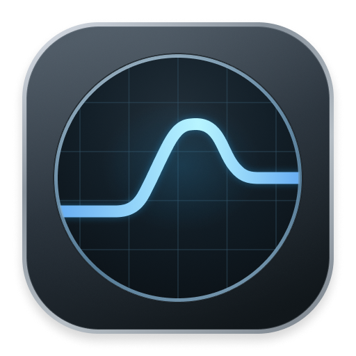
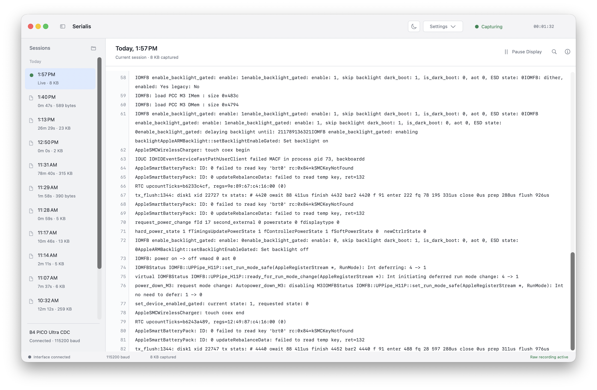
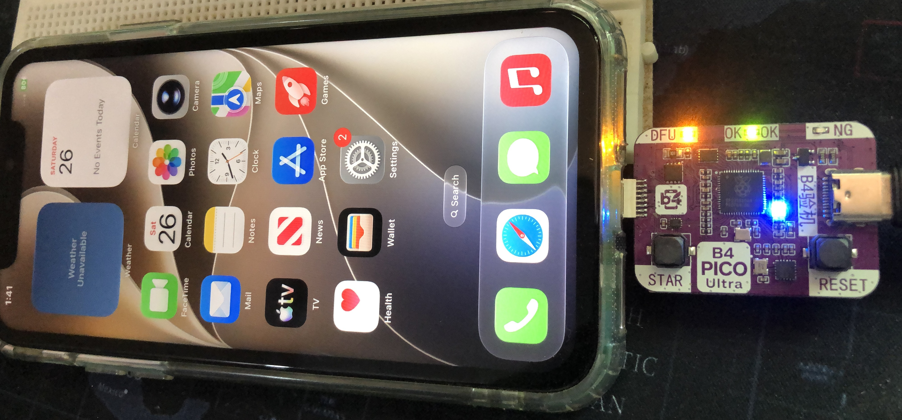

<p align="center">
  
</p>

<h1 align="center">Serialis</h1>

<p align="center">A native macOS serial console for live logs and saved research sessions.</p>

Serialis detects a supported USB interface, captures its serial output, and saves the raw bytes while you read, search, or browse earlier sessions. It remembers the device identity, so a changing `/dev/cu.usbmodem…` path does not require manual configuration.

Built with **Swift and AppKit**, with no third-party dependencies.

## Features

- **Automatic capture** at 115200 baud, with remembered interface selection and reconnect handling.
- **Live logs that wrap** with the window, including character-level selection and native copy/paste.
- **Search with match counts**, previous/next navigation, and keyboard shortcuts.
- **Pause the display while recording continues**, then resume with the intervening logs available.
- **Saved sessions** with raw output, byte-preserving selection export, and connection history.
- **Light and dark appearance**, switched beside Settings.

<picture>
  <source media="(prefers-color-scheme: light)" srcset="images/serialis-dark.png">
  <source media="(prefers-color-scheme: dark)" srcset="images/serialis-light.png">
  
</picture>

*App previews use synthetic logs. [Light preview](images/serialis-light.png) · [Dark preview](images/serialis-dark.png)*

## Supported hardware

The current device profile supports **B4 Pico Ultra CDC** at **115200 baud, 8N1, no flow control**. Other serial adapters and configurable baud rates are not tested yet.

Discovery requires VID `2e8a`, PID `00b7`, manufacturer `B4`, product `B4 PICO Ultra CDC`, and a nonempty USB serial number. Serialis is an independent application, not a vendor firmware utility. It receives serial output; it does not send commands or configure the connected device's firmware.

<picture>

</picture>

## Build and run

Requires **macOS 13 or later**. The Xcode project requires **Xcode 16 or later**. Runtime validation so far has been on Apple Silicon with macOS 26.7; earlier supported macOS versions have not been tested.

### Xcode

1. Open `Serialis.xcodeproj`.
2. Select the **Serialis** scheme and **My Mac** destination.
3. In **Serialis target → Signing & Capabilities**, select your development team.
4. Run with **⌘R**. Run the core tests with **⌘U**.

Automatic signing is enabled, with the team unset in the repository. The bundle identifier is `com.xplo8e.serialis` in Debug and Release. Xcode builds include the app icon.

### Command line

With Xcode's command-line tools selected:

```sh
./scripts/build-app.sh
open dist/Serialis.app
```

The script builds through Swift Package Manager and creates a local ad-hoc signed app. It does not compile the Xcode icon catalog. Use Xcode for the branded application and your development signing identity. These local builds are not notarized distribution releases.

## Start capturing

- On first use, one supported interface is selected automatically. If several are connected, choose one in **Settings**.
- The selection is remembered using USB identity and serial number. A missing remembered device is not replaced with another board.
- Reconnecting the selected board resumes the current session. Switching interfaces records a new segment with its byte offsets.
- If another program such as `tio` owns the port, close that connection and choose **Retry**. Serialis does not terminate the other program.

## Command line

Open **Serialis → Install Command-Line Tool…** and save `serialis` in a directory on your `PATH` (the default is `~/.local/bin`). Keep the app in its final location before installing. If needed, add this to your shell configuration:

```sh
export PATH="$HOME/.local/bin:$PATH"
```

```sh
serialis                              # Stream live logs and save the full capture
serialis --devices                    # List supported interfaces and stable IDs
serialis --device ID                  # Choose an interface when starting capture
serialis --tail 100 --no-follow        # Read a snapshot of the active capture
serialis --tail 100 --json             # Recent logs, then live JSON records
serialis -m AppleSEP -m panic          # Include either literal term
serialis -m AppleSEP -m error --match-all
serialis -m AppleSEP -M heartbeat -i   # Case-insensitive inclusion and exclusion
serialis --version                    # Same bundle version as the GUI
serialis --help
```

The first GUI or CLI process owns capture. Later processes follow its active session without opening the serial port. The GUI disables interface selection while following another process. Pausing the GUI display or browsing history does not interrupt CLI output.

Without `--tail`, streaming starts with new lines. `--no-follow` prints the latest 100 source lines and exits, or the count supplied with `--tail`. Snapshot mode requires an active capture. Filters apply after selecting those source lines and never change saved data. Repeat `--match` for OR, add `--match-all` for AND, and repeat `--unmatch` to exclude any term. Matching is literal and case-sensitive unless `-i` is supplied.

Ctrl+C stops your capture if you own it; otherwise it only detaches your CLI. Followers exit when the capture owner stops, and never take ownership automatically. Owners wait for reconnection by default; `-x` / `--exit-on-disconnect` exits on disconnect. With multiple interfaces connected, the CLI requires `--device ID` when starting a capture. An explicit device conflicting with an active capture is rejected.

Logs go to stdout and connection messages to stderr. `--no-timestamps` hides dates in text output. `--json` emits session ID, byte offset, timestamp (UTC ISO 8601 or `null`), message, and a `partial` flag. Incomplete lines are buffered until completion or shutdown; lines larger than 1 MiB are emitted as partial fragments to bound memory. Filters apply separately to these fragments. Text output escapes terminal control characters, and decoded text may replace invalid UTF-8; `capture.raw` remains byte-exact.

For a source build, use `xcrun swift run Serialis --cli --help`. Unbundled development builds report `development`; packaged GUI and CLI read the same app version. `SERIALIS_SESSIONS_DIR` overrides the sessions directory for both interfaces, including isolated tests.

## Files and memory

Sessions live under `~/Library/Application Support/Serialis/Sessions/`. Each app run creates a directory named with the Mac’s local start time, such as `2026-09-28_11-05-17`. Sessions started in the same second get suffixes (`-2`, `-3`, etc.). The UUID stays in `metadata.json`; existing UUID-named folders remain supported. Each directory contains:

| File | Purpose |
| --- | --- |
| `capture.raw` | Exact incoming bytes, including non-text data |
| `timestamps.idx` | Mac receive times mapped to captured byte ranges |
| `rows.idx` | Little-endian 64-bit byte offsets for display rows |
| `metadata.json` | Session times, device segments, and events |

Log dates and times use the Mac’s local timezone, with millisecond precision. Each row shows when its first byte was received; rows received together share a timestamp. These are host receive times, not device event times. Older sessions without timestamps show a dash. Raw capture and selection exports remain unchanged.

The viewer reads visible rows on demand. Search and export read small chunks. The capture queue coalesces UI updates so a blocked window does not accumulate snapshots.

The current wrapped viewer exceeded the 100 MB peak-footprint target in the large-session Release checks; it is not yet a guaranteed memory ceiling.

Data is written on receipt and synchronized approximately once per second or every MiB. Normal exit finishes the session. An abrupt power loss can still lose recently buffered bytes. Interrupted index writes can be repaired from the raw file when opening a session. Original raw data is never rewritten by recovery.

There is no automatic deletion or retention limit. Use **Open Sessions Folder** to archive old captures. Disk-write errors stop capture and are shown in the status bar.

## Development

```sh
xcrun swift test
dist/Serialis.app/Contents/MacOS/Serialis --list-devices
dist/Serialis.app/Contents/MacOS/Serialis --transport-smoke
dist/Serialis.app/Contents/MacOS/Serialis --cli-smoke
python3 scripts/test-cli.py dist/Serialis.app/Contents/MacOS/Serialis
/usr/bin/time -l dist/Serialis.app/Contents/MacOS/Serialis --benchmark
dist/Serialis.app/Contents/MacOS/Serialis --ui-smoke
```

The benchmark writes a 1 GiB fixture under `benchmark-results/`, performs random reads, and searches the full file. UI smoke tests use temporary fixtures and never open hardware. Use `--ui-smoke --no-snapshot --session PATH` to exercise an existing saved fixture without allocating an image.

## License

Copyright © 2026 Vinay Kumar Rasala (Xplo8E).

Serialis is licensed under the [GNU General Public License, version 3 only](LICENSE) (`GPL-3.0-only`).
